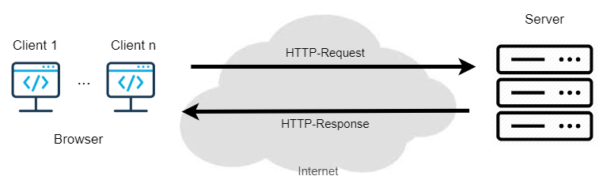

# NILE Microteaching

### Remark
If you use this exercise in real, please exchange the used website...

### Topic: Client/Server communication

### Kommunikation zwischen Client und Server
Leitfrage: Wie kommunizieren Client (Browser) und Server (Webserver) miteinander? 

Antwort: Über das HTTP-Protokoll (Pull-Modell) bestehend aus Request (Anfrage vom Client) und 
Response (Antwort vom Server):

https://learning.nile-elt.com/d2l/home

### Padlet
https://drive.google.com/drive/folders/1sclgmS10hwpnICsRLSFjNgleCBoli65m
